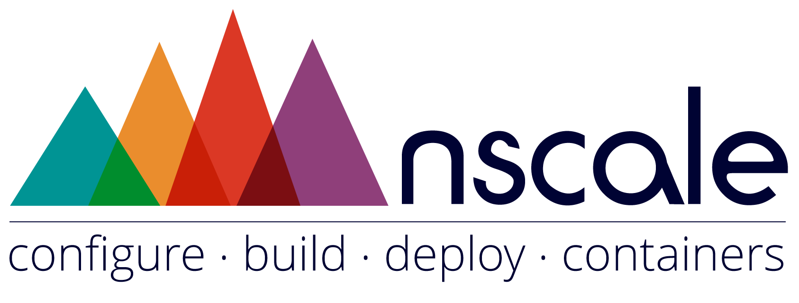

> _A toolkit for application deployments and container management_

[nscale] is an open toolkit supporting configuration, build and deployment of connected container sets. __nscale__ is ideally used to support the development and operation of __microservice__ based systems.

# Azure Virtual Network Container
Manages the creation, deployment, linking and unlinking of Azure Virtual Networks for [nscale]. The
azure-vn-analyzer is used internally by [nscale], see nscale's [documentation] for information on how
to deploy using Azure as the target platform.

> WIP: NOT YET IN A USABLE STATE

## License
Copyright (c) 2015 [nearForm] and other contributors

Licensed under the Artistic License 2.0

[nscale]: http://github.com/nearform/nscale
[nearForm]: http://nearform.com
[documentation]: http://github.com/nearform/nscale-docs
